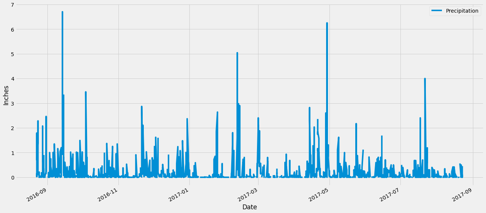
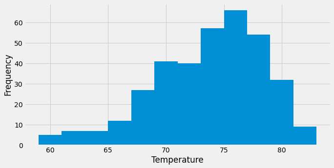

# sqlalchemy-challenge
Module 10 submission for UC Berkeley data science bootcamp.

## Part 1: Analyze and Explore the Climate Data
We used Python and SQLAlchemy to do a basic climate analysis and data exploration of the `hawaii.sqlite` climate database. Specifically, we used SQLAlchemy ORM queries, Pandas, and Matplotlib.

1. Use the SQLAlchemy create_engine() function to connect to the `hawaii.sqlite` SQLite database.

2. Use the SQLAlchemy automap_base() function to reflect your tables into classes, and then save references to the classes named station and measurement.

3. Link Python to the database by creating a SQLAlchemy session.

### Precipitation Analysis

1. Find the most recent date in the dataset.

2. Using that date, get the previous 12 months of precipitation data by querying the previous 12 months of data. Select only the "date" and "prcp" values.

3. Load the query results into a Pandas DataFrame. Explicitly set the column names.

4. Sort the DataFrame values by "date".

5. Plot the results by using the DataFrame plot method:

    

6. Print summary statistics for the precipitation data.

    || Precipitation |
    |---|---|
    | count | 2021.000000 |
    | mean | 0.177279 |
    | std | 0.461190 |
    | min | 0.000000 |
    | 25% | 0.000000 |
    | 50% | 0.020000 |
    | 75% | 0.130000 |
    | max | 6.700000 | 

### Station Analysis

1. Design a query to calculate the total number of stations in the dataset.

2. Design a query to find the most-active stations (that is, the stations that have the most rows).
    - List the stations and observation counts in descending order.
    - Which station id has the greatest number of observations?

3. Design a query that calculates the lowest, highest, and average temperatures that filters on the most-active station id found in the previous query.

4. Design a query to get the previous 12 months of temperature observation (TOBS) data.
    - Filter by the station that has the greatest number of observations.
    - Query the previous 12 months of TOBS data for that station.
    - Plot the results as a histogram with bins=12, as the following image shows:

    

## Part 2: Design Your Climate App
Now we design a simple Flask API based on the queries we developed.

- `\`
    - Start at the homepage.
    - List all the available routes.

- `/api/v1.0/precipitation`
    - Convert the query results from our precipitation analysis (i.e. retrieve only the last 12 months of data) to a dictionary using date as the key and prcp as the value.
    - Return the JSON representation of your dictionary.

- `/api/v1.0/stations`
    - Return a JSON list of stations from the dataset.

- `/api/v1.0/tobs`
    - Query the dates and temperature observations of the most-active station for the previous year of data.
    - Return a JSON list of temperature observations for the previous year.

- `/api/v1.0/<start> and /api/v1.0/<start>/<end>`
    - Return a JSON list of the minimum temperature, the average temperature, and the maximum temperature for a specified start or start-end range.
    - For a specified start, calculate TMIN, TAVG, and TMAX for all the dates greater than or equal to the start date.
    - For a specified start date and end date, calculate TMIN, TAVG, and TMAX for the dates from the start date to the end date, inclusive.